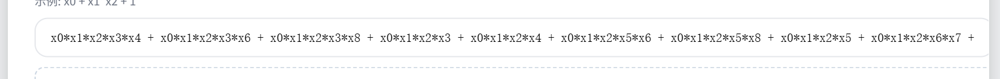
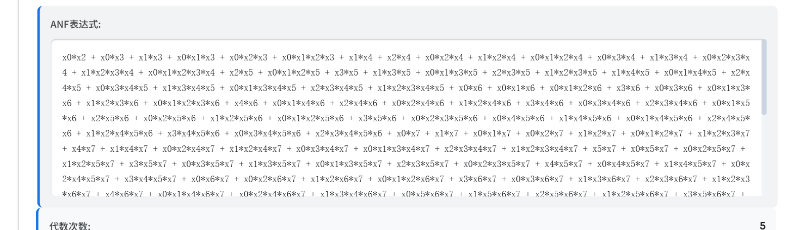

✅ 并发：多核并行 FWT/FMT

✅ 内存安全：自动管理 + 无 data race

✅ 易于封装：可以直接导出为 WebAssembly / HTTP 服务（算力API）

✅ SIMD：可以手动用 unsafe + AVX2 进一步提

问题1：我写入的十六进制和整数是根据n（布尔函数的元数）来决定其真值表，所以n必须得是对的
问题2：我添加了respose中的truthtable，但是我发现输出是乱码不知道咋回事。后面发现是由于我的真值表返回类型是[]byte，
在 JSON 序列化（json.Marshal）时，Go 默认会把它当作 Base64 编码的二进制数据 来处理！tt := []byte{0, 1, 0, 1}
json.Marshal(tt) // 这是 base64(0x00 0x01 0x00 0x01)
问题3：莫比乌斯逆变换没写，将输入的代数标准型转换为真值表形式，这样在构造方法那里又可以加一个，这个后面写吧
问题4：代数标准型长的和sagemath不一样，我初步判（一般我的初步判断都是对的）断算法没问题应该是表示方式的问题，我的是x0最高位，sage是x0最低位
*问题4更新*： 我现在的代码由真值表转换为anf的时候是x0最高位，但是anf转为真值表的时候是x0最低位
*问题4再更新*：好像我的代码也是x0最低位，他们看起来长的不一样但是是一样的因为满足交换律，排序顺序不同项的位置不一样
问题四证明方法：后端将anf转换为真值表然后在从真值表重新走一遍，而不是用一开始的真值表。这样来看最后呈现的是不是一样

证明完毕，逻辑就是一样的x0最低位，就是顺序不一样

优势1：使用unint64位打包，存一个64位的数然后进行位操作，不足64位的数用0填充（计算性质的时候在遍历到length的长度就好）

#### 新性质
差分均匀度

### 后端输入性质（接受4种输入类型）
输入参数：
type (必需) - 输入类型，支持：
还有一共变元数n
"truthTable" - 真值表输入
"hex" - 十六进制输入
"int" - 整数输入
"anf" - ANF代数正规式输入
根据不同type的必需参数：

truthTable: truthTable ([]byte)
hex: n (int), hexValue (string)
int: n (int), intValue (uint64)
anf: n (int), anfExpression (string)

### 后端输出性质（共18个性质）
##### 基本信息：
n - n元布尔函数的变元数量
truthTable - 真值表 ([]int)

##### 基础性质：
hammingWeight - 汉明重量
isBalanced - 是否平衡
anf - 代数正规式 (ANF)
algebraicDegree - 代数次数

频谱分析：
walshSpectrum - Walsh-Hadamard谱
autocorrelationSpectrum - 自相关谱
absoluteWalshSpectrum - 绝对Walsh谱分布 (map[int64]int) int64适用于不同机器的兼容性
absoluteAutocorrelationSpectrum - 绝对自相关谱分布 (map[int64]int)

密码学性质：
nonlinearity - 非线性度
correlationImmunity - 相关免疫度
resiliencyOrder - 弹性阶数
AlgebraicImmunity - 代数免疫度
Annihilator - 零化因子
transparencyOrder - 透明度阶
isBent - 是否为Bent函数
其他性质：
sumOfSquareIndicator - 平方和指标
isRotationSymmetric - 是否旋转对称
absoluteIndicator - 绝对指标
differentialUniformity - 差分均匀度

代数免疫度：AlgebraicImmunity - 代数免疫度
✅ 函数已定义在 crypto_props.go 中
❌ 但返回错误：未实现
❌ 未在 AnalyzeResponse 结构体中定义字段
❌ 未在 handlers.go 中调用

- 绝对指标：AbsoluteIndicator - 绝对指标 这个添加了我看懂了应该是没问题
- 新添加了代数免疫度后续要进行json测试，检查数据计算是否正确
- 代数免疫和零化因子，我现在用的是gemini的代码，到时候要进行检查测试，还有json测试
- 还添加了差分均匀度，这个和绝对指标有线性关系，我觉得应该没问题但还是要看下
- 前端界面anf表达式部分，没有做滚动条
- 相关免疫度和弹性阶数的显示有问题，当返回的是-1前端显示N/A当透明度阶为0时，JavaScript中的0会被判断为falsy值，所以analysisResult.transparencyOrder ? ... : 'N/A'会错误地显示'N/A'。
- 透明度阶的数据展示小数点后几位偏少，应该多点

数据测试：
85320B0C14DB50F10774F7CB3750BA16416A7E61AE7FF4CF4F6F2601CE88467C34126DCD3EF97C4698E92FEBBB21A0AE64BB6DEA49395102A5B895D0347C6EA0