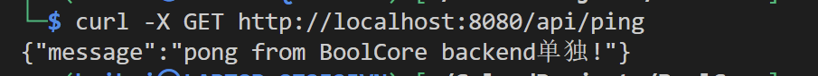
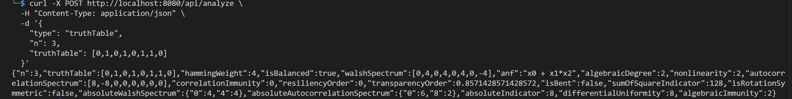
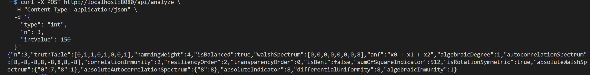
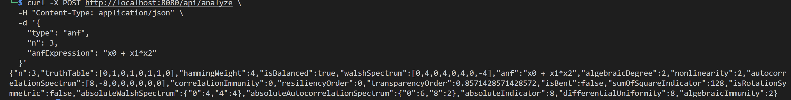
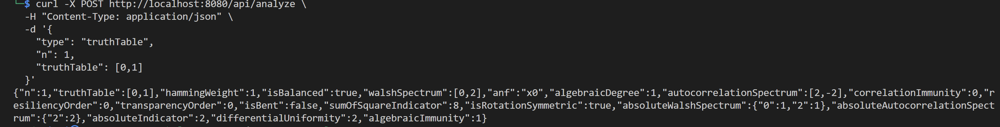
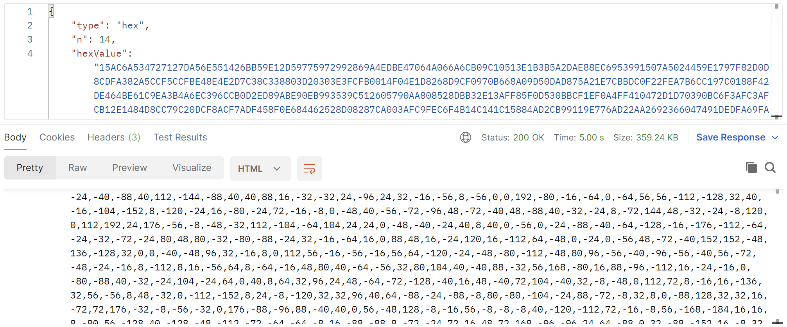
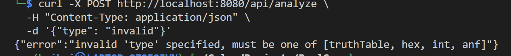
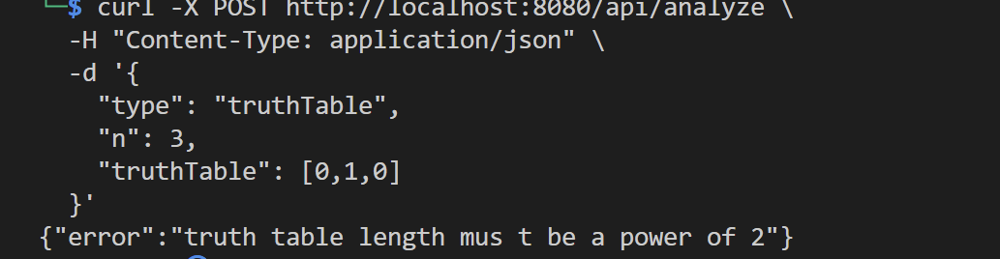
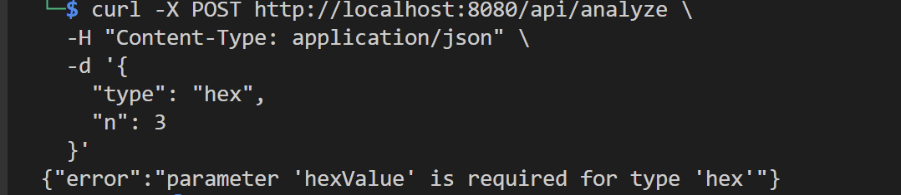

# BoolCore 测试文档

## 5. 系统测试与结果

### 5.1 测试方案

#### 5.1.1 测试目标
- **功能完整性验证**：确保所有API接口和18+种密码学性质计算的准确性
- **输入格式兼容性**：验证真值表、十六进制、整数、ANF四种输入格式
- **性能基准测试**：评估响应时间、吞吐量和内存使用
- **边界条件处理**：测试极限情况和错误处理能力

#### 5.1.2 测试环境
```bash
# 启动后端服务
cd backend && go run cmd/server/main.go

# 启动前端服务  
cd frontend && npm run dev

# 验证服务状态
curl http://localhost:8080/api/ping
```

### 5.2 功能测试

#### 5.2.1 基础API测试

**测试用例 FT-001: 连接测试**
```bash
curl -X GET http://localhost:8080/api/ping
```
**预期结果**: HTTP 200, `{"message": "pong from BoolCore backend单独!"}`


**测试用例 FT-002: 真值表输入**
```bash
curl -X POST http://localhost:8080/api/analyze \
  -H "Content-Type: application/json" \
  -d '{
    "type": "truthTable",
    "n": 3,
    "truthTable": [0,1,0,1,0,1,1,0]
  }'
```

**测试用例 FT-003: 十六进制输入**
```bash
curl -X POST http://localhost:8080/api/analyze \
  -H "Content-Type: application/json" \
  -d '{
    "type": "hex",
    "n": 3,
    "hexValue": "96"
  }'
```

**测试用例 FT-004: 整数输入**
```bash
curl -X POST http://localhost:8080/api/analyze \
  -H "Content-Type: application/json" \
  -d '{
    "type": "int",
    "n": 3,
    "intValue": 150
  }'
```

**测试用例 FT-005: ANF输入**
```bash
curl -X POST http://localhost:8080/api/analyze \
  -H "Content-Type: application/json" \
  -d '{
    "type": "anf",
    "n": 3,
    "anfExpression": "x0 + x1*x2"
  }'
```

#### 5.2.2 边界条件测试

**测试用例 FT-006: 最小函数(n=1)**
```bash
curl -X POST http://localhost:8080/api/analyze \
  -H "Content-Type: application/json" \
  -d '{
    "type": "truthTable",
    "n": 1,
    "truthTable": [0,1]
  }'
```

**测试用例 FT-007: 大规模函数(n=6)**
```bash
curl -X POST http://localhost:8080/api/analyze \
  -H "Content-Type: application/json" \
  -d '{
    "type": "hex",
    "n": 14,
    "hexValue": "15AC6A534727127DA56E551426BB59E12D59775972992869A4EDBE47064A066A6CB09C10513E1B3B5A2DAE88EC6953991507A5024459E1797F82D0D8CDFA382A5CCF5CCFBE48E4E2D7C38C338803D20303E3FCFB0014F04E1D8268D9CF0970B668A09D50DAD875A21E7CBBDC0F22FEA7B6CC197C0188F42DE464BE61C9EA3B4A6EC396CCB0D2ED89ABE90EB993539C512605790AA808528DBB32E13AFF85F0D530BBCF1EF0A4FF410472D1D70390BC6F3AFC3AFCB12E1484D8CC79C20DCF8ACF7ADF458F0E684462528D08287CA003AFC9FEC6F4B14C141C15884AD2CB99119E776AD22AA2692366047491DEDFA69FA6A6CA5935212C758DAA41A5E46A1E95BB06CFF930BED11B7BD7FF720FD20377BC034403E13C14CCB16B822E27CF2CCFACD5868536673765823BFDE107CC392C26510F5BFF43D21388191A3E455094A06E9508150921277482994C69EBA61EB6BB7759D2A672A5D755E43441DE5C6AA315F5CE0434BE401B1F397749250BAA015A96DC6683E158BBA2C27CC8CC709C206C66C76922BBD51E7A718DD3C7DDC6F8C940BC5F13A10EEBFB6BD26E77EFA54FAA2D9557687DAA27A5EBEDB147C5593A86596B596F47D7128D28BE66E495B395E14ABF6AF0CE00CB2DCB2BB15E0B1905B6A723A26C2B2889721E8FBB20C39F8C68CF1EEF40331B3C41A28DB757FC357C3560039FFC4EB7141D270F7D0077302DCFD797729F3625467576C32933F2B408EE22B278E3FFA12FAB9B5F6DAF15142AB1DEB17414C2893FF7D3220C870B27FF821B33BEC34B0CEE0C5C3F5C3F720BD7DE4FB11014C1FA3B0A5AFBAAF187E9DDB957EEAD34D3998C696C809CF08D322839D3D17285F965D96511A9B4A94196E4665586A527A98756266553BAAC7BEBD94EA532AA289A226578A93552CA151B9741D848821D6056605E4B6511654E991496254B8AEEB796C299C9F2C6F3823CD8DCFE410B1B4CA0E3AFAAE0A540DD447863A9C3B9CCEE3FB43F3AF33AF382EDD8B847BEEDE4F3900C6F2F78C02200280F72A7C1A2C4F045FFEDE9FA47F55B0BAC4127267D866CA863AD6D33983C3FEED04BCFB1CBEB409CE06C66E39648225487A129B48911F7A5F255F5C205278D70D7DF2048721D839A4C654B5611A9BE55E4A5967D6627562256789AF69AF61D14374ED7D58D7AAF665F9252FF530F8C6A2C4B870E22FBC3B933161A39B2C9941491EEB84E12143FAC3FAC0C870CDD4CD83C82E4F0BE0091F34B0C06C0F93F8D12D7476BFF4EB0B43F11C060F39F0C8274272121BE8A1BD335F3351FDD3B383C28338D2240380F329E3C24509C5E9BE6E4B641D8487DA2F5D6FA898AF0DAFF3DB437EE997296D79A879A22A990A9907B9BD1BE98F17D843A56D5A91165B49A4EA5EBAA67116D6BD055805A508C5FD37902D8F843B6131BF1C7FBC9693B668178E522BAA27D58D889FBD6F500250F7511C84BC26087BFDF9BC361CC935E9C5441B6E4E61B8BBE2135F335F787C022C072CCD7C30FB100143FEEC04B0C9FF3602127F4821B13BE43C9FBC6F13E99849645DD1A87B492EE98A57FEA2FD3578C50F8D8027D847DD1D8A9C4563A654B9AEE551452B128698DE6DD65796590A991A9BED11B7B9881826987A9DDA9F692F69A4EB6141D1D724828655C9AA352EEA9B45A1BAA41EE764BD6AA0D5A083705C2F5DFD7708DEBDB39CE6CE09C40B3691C995E78ABDDFF410F1BF3B40CEE3FF9C00645D712AD141346B82C3FA43F22B338F37DC3273304DDF138E9CC463CC9BA391A6E9114947A8DD557925F67AFF0A800ADB4D311731B0B41FEAFE3A04CB95A1F558E879B221175A4DA663D69C0F7C6D2C99CD8FC821D8248D8566056609AEE9AB469AB66B157558D5A87BADD65CA5635A945B71B1D867D2627AD63A87CC367CC92B42F11803BDD3A781A00BA0FB446FAED41AE1B5BE4EDBE472B0E90F3DD3F87C08DF0D7FF334E3C1CC04BC019F33AF33AB8D8ED823C41CCE4F311F3B43F5C3F5CDED78B721414B0DED63F09C078F3DD0C7D00D8F01C874CDD54F05E00AF615F9BB04A1C159D7897D775C62536CCD63C8911F74B0DDA5A7DAAD5A978D6AC9A53650ED1EB7B8472D1D765F965F9564B46EE991B69BE4B5211A89673662CD09C806C3828328D1410B3CF0A3BF8C10E5504A5462216386F596F588D1AD7471B9901961E6A446A95886AD25AD8558247B1EDEBA63A59C5135EBC50FBEB0EB388912D9455B05A30CD963C9985E92A4457D38D73C9F8C6FFFC9F03601D94B75EFF82F0D830D2CF88BB30E130BEC3E4CCD7B78DE235FC35FE6CA263A772A92829DF4470E19733623C8F1500B5D234773B5EB9ABEBB605190A00A4B2AE6FEC2DBC45BE1A1B6EA094503685C6D5826D2767F81E0244D9C386331EFCBBFE4E33EBC3272A823BACCFACCF30F9EF067B1BD1BEF08D00282398FC2D7C9923695D44A71EDCC87DC264209C703405CEF51F1B40BED2B688E6A5FE55F4593DA688AA2C5A8DDC4174E495A36A5C0995899582742721149EB066445BE359FC3AFC3A84142EB13C823327307730D2E1B044CFBE001B0FD6D172847FFC90030A7905268D5229A8C71ECD442A0F7A00336B3C9177102D4FB94EE9EB519C5B93355BCAA68D7428211B5AB655446AE195952D958899D8965DDAB1FC14A69FA69FF4C6FFC91C1C4CB12DB577EA69CE663474AE20A59DBB97EB29088DF2AF23A07CF54A78AA861E26BBC0D0027F0A38FACD109CB06C3B1B3E417751D2A466BC9613A688A6D296D7668D43BEEDE46A066A06536AAD957D122747E9AAB15A1EA64459C3E63349D20B77FE01BE60E44A39AAC9509DA0688275D8DA234483E158005DF044031EFDB10FEBFFD848821DF6308BEFCF7CCF5CE2E448BECC723C28FC2DFC73"
  }'
```


**测试用例 FT-008: 错误输入处理**
```bash
# 无效类型
curl -X POST http://localhost:8080/api/analyze \
  -H "Content-Type: application/json" \
  -d '{"type": "invalid"}'


# 真值表长度错误
curl -X POST http://localhost:8080/api/analyze \
  -H "Content-Type: application/json" \
  -d '{
    "type": "truthTable",
    "n": 3,
    "truthTable": [0,1,0]
  }'

# 缺少必需参数
curl -X POST http://localhost:8080/api/analyze \
  -H "Content-Type: application/json" \
  -d '{
    "type": "hex",
    "n": 3
  }'
```





### 5.3 性能测试

#### 5.3.1 响应时间测试
使用以下命令测试不同规模函数的响应时间：

```bash
# n=3 响应时间测试
time curl -X POST http://localhost:8080/api/analyze \
  -H "Content-Type: application/json" \
  -d '{"type":"int","n":3,"intValue":150}'

real    0m0.018s
user    0m0.010s
sys     0m0.007s
这表示：命令总共执行了 18 毫秒；其中 用户态计算 Go 程序的逻辑部分占了约 10 毫秒；系统调用（网络请求、I/O 等）占了约 7 毫秒；两者加起来略小于总耗时因为 real 还包括调度、等待等时间。

# n=8 响应时间测试
time curl -X POST http://localhost:8080/api/analyze \
  -H "Content-Type: application/json" \
  -d '{"type":"int","n":8,"intValue":12345678}'
real    0m0.130s
user    0m0.011s
sys     0m0.023s

# n=14 响应时间测试
time curl -X POST http://localhost:8080/api/analyze \
  -H "Content-Type: application/json" \
  -d '{
    "type": "hex",
    "n": 14,
    "hexValue": "15AC6A534727127DA56E551426BB59E12D59775972992869A4EDBE47064A066A6CB09C10513E1B3B5A2DAE88EC6953991507A5024459E1797F82D0D8CDFA382A5CCF5CCFBE48E4E2D7C38C338803D20303E3FCFB0014F04E1D8268D9CF0970B668A09D50DAD875A21E7CBBDC0F22FEA7B6CC197C0188F42DE464BE61C9EA3B4A6EC396CCB0D2ED89ABE90EB993539C512605790AA808528DBB32E13AFF85F0D530BBCF1EF0A4FF410472D1D70390BC6F3AFC3AFCB12E1484D8CC79C20DCF8ACF7ADF458F0E684462528D08287CA003AFC9FEC6F4B14C141C15884AD2CB99119E776AD22AA2692366047491DEDFA69FA6A6CA5935212C758DAA41A5E46A1E95BB06CFF930BED11B7BD7FF720FD20377BC034403E13C14CCB16B822E27CF2CCFACD5868536673765823BFDE107CC392C26510F5BFF43D21388191A3E455094A06E9508150921277482994C69EBA61EB6BB7759D2A672A5D755E43441DE5C6AA315F5CE0434BE401B1F397749250BAA015A96DC6683E158BBA2C27CC8CC709C206C66C76922BBD51E7A718DD3C7DDC6F8C940BC5F13A10EEBFB6BD26E77EFA54FAA2D9557687DAA27A5EBEDB147C5593A86596B596F47D7128D28BE66E495B395E14ABF6AF0CE00CB2DCB2BB15E0B1905B6A723A26C2B2889721E8FBB20C39F8C68CF1EEF40331B3C41A28DB757FC357C3560039FFC4EB7141D270F7D0077302DCFD797729F3625467576C32933F2B408EE22B278E3FFA12FAB9B5F6DAF15142AB1DEB17414C2893FF7D3220C870B27FF821B33BEC34B0CEE0C5C3F5C3F720BD7DE4FB11014C1FA3B0A5AFBAAF187E9DDB957EEAD34D3998C696C809CF08D322839D3D17285F965D96511A9B4A94196E4665586A527A98756266553BAAC7BEBD94EA532AA289A226578A93552CA151B9741D848821D6056605E4B6511654E991496254B8AEEB796C299C9F2C6F3823CD8DCFE410B1B4CA0E3AFAAE0A540DD447863A9C3B9CCEE3FB43F3AF33AF382EDD8B847BEEDE4F3900C6F2F78C02200280F72A7C1A2C4F045FFEDE9FA47F55B0BAC4127267D866CA863AD6D33983C3FEED04BCFB1CBEB409CE06C66E39648225487A129B48911F7A5F255F5C205278D70D7DF2048721D839A4C654B5611A9BE55E4A5967D6627562256789AF69AF61D14374ED7D58D7AAF665F9252FF530F8C6A2C4B870E22FBC3B933161A39B2C9941491EEB84E12143FAC3FAC0C870CDD4CD83C82E4F0BE0091F34B0C06C0F93F8D12D7476BFF4EB0B43F11C060F39F0C8274272121BE8A1BD335F3351FDD3B383C28338D2240380F329E3C24509C5E9BE6E4B641D8487DA2F5D6FA898AF0DAFF3DB437EE997296D79A879A22A990A9907B9BD1BE98F17D843A56D5A91165B49A4EA5EBAA67116D6BD055805A508C5FD37902D8F843B6131BF1C7FBC9693B668178E522BAA27D58D889FBD6F500250F7511C84BC26087BFDF9BC361CC935E9C5441B6E4E61B8BBE2135F335F787C022C072CCD7C30FB100143FEEC04B0C9FF3602127F4821B13BE43C9FBC6F13E99849645DD1A87B492EE98A57FEA2FD3578C50F8D8027D847DD1D8A9C4563A654B9AEE551452B128698DE6DD65796590A991A9BED11B7B9881826987A9DDA9F692F69A4EB6141D1D724828655C9AA352EEA9B45A1BAA41EE764BD6AA0D5A083705C2F5DFD7708DEBDB39CE6CE09C40B3691C995E78ABDDFF410F1BF3B40CEE3FF9C00645D712AD141346B82C3FA43F22B338F37DC3273304DDF138E9CC463CC9BA391A6E9114947A8DD557925F67AFF0A800ADB4D311731B0B41FEAFE3A04CB95A1F558E879B221175A4DA663D69C0F7C6D2C99CD8FC821D8248D8566056609AEE9AB469AB66B157558D5A87BADD65CA5635A945B71B1D867D2627AD63A87CC367CC92B42F11803BDD3A781A00BA0FB446FAED41AE1B5BE4EDBE472B0E90F3DD3F87C08DF0D7FF334E3C1CC04BC019F33AF33AB8D8ED823C41CCE4F311F3B43F5C3F5CDED78B721414B0DED63F09C078F3DD0C7D00D8F01C874CDD54F05E00AF615F9BB04A1C159D7897D775C62536CCD63C8911F74B0DDA5A7DAAD5A978D6AC9A53650ED1EB7B8472D1D765F965F9564B46EE991B69BE4B5211A89673662CD09C806C3828328D1410B3CF0A3BF8C10E5504A5462216386F596F588D1AD7471B9901961E6A446A95886AD25AD8558247B1EDEBA63A59C5135EBC50FBEB0EB388912D9455B05A30CD963C9985E92A4457D38D73C9F8C6FFFC9F03601D94B75EFF82F0D830D2CF88BB30E130BEC3E4CCD7B78DE235FC35FE6CA263A772A92829DF4470E19733623C8F1500B5D234773B5EB9ABEBB605190A00A4B2AE6FEC2DBC45BE1A1B6EA094503685C6D5826D2767F81E0244D9C386331EFCBBFE4E33EBC3272A823BACCFACCF30F9EF067B1BD1BEF08D00282398FC2D7C9923695D44A71EDCC87DC264209C703405CEF51F1B40BED2B688E6A5FE55F4593DA688AA2C5A8DDC4174E495A36A5C0995899582742721149EB066445BE359FC3AFC3A84142EB13C823327307730D2E1B044CFBE001B0FD6D172847FFC90030A7905268D5229A8C71ECD442A0F7A00336B3C9177102D4FB94EE9EB519C5B93355BCAA68D7428211B5AB655446AE195952D958899D8965DDAB1FC14A69FA69FF4C6FFC91C1C4CB12DB577EA69CE663474AE20A59DBB97EB29088DF2AF23A07CF54A78AA861E26BBC0D0027F0A38FACD109CB06C3B1B3E417751D2A466BC9613A688A6D296D7668D43BEEDE46A066A06536AAD957D122747E9AAB15A1EA64459C3E63349D20B77FE01BE60E44A39AAC9509DA0688275D8DA234483E158005DF044031EFDB10FEBFFD848821DF6308BEFCF7CCF5CE2E448BECC723C28FC2DFC73"
  }'

real    0m4.986s
user    0m0.016s
sys     0m0.006s
```

#### 5.3.2 并发性能测试

**使用wrk工具**:
```bash
# 安装wrk (Ubuntu: sudo apt install wrk, macOS: brew install wrk)

# 创建POST脚本
cat > post_test.lua << 'EOF'
wrk.method = "POST"
wrk.body = '{"type":"truthTable","n":4,"truthTable":[0,1,0,1,0,1,1,0,1,0,1,0,1,0,0,1]}'
wrk.headers["Content-Type"] = "application/json"
EOF

# 运行并发测试
wrk -t4 -c50 -d30s -s post_test.lua http://localhost:8080/api/analyze
数据输出：
Running 30s test @ http://localhost:8080/api/analyze
  4 threads and 50 connections
  Thread Stats   Avg      Stdev     Max   +/- Stdev
    Latency    31.10ms   47.63ms 345.76ms   86.04%
    Req/Sec     1.51k   668.33     3.01k    66.67%
  169689 requests in 30.07s, 112.15MB read
Requests/sec:   5643.51
Transfer/sec:      3.73MB
```
输出内容解释：
| 指标          | 含义            | 数据说明                                                                       |
| ----------- | ------------- | ---------------------------------------------------------------------------- |
| **Latency** | 平均延迟每个请求的耗时 | 平均每个请求 **31.10ms**，标准差 47.63ms），说明有时快、有时慢。最大延迟高达 **345.76ms**，说明有少数慢请求。 |
| **Req/Sec** | 每个线程每秒能发的请求数  | 每个线程平均每秒约 **1510 次**，四个线程总计大约 6000 QPS。标准差 668 表示波动较大。              |

| 项目                 | 评价                                                                    |
| ------------------ | --------------------------------------------------------------------- |
|  **吞吐量 (QPS)**   | 5643 req/s说明 `/api/analyze` 算法每秒能处理约 5600 次请求。        |
|  **平均延迟**        | 31 ms，用户几乎无感延迟，非常快。                                                   |
|  **延迟波动较大**       | 标准差 47 ms，最大延迟 345 ms，说明有部分请求耗时偏长猜测goroutine 调度。 |


// 下面这个也是并发测试，我觉得不要了，如果字数不够就加
**使用Apache Bench**:
```bash
# 创建测试数据文件
echo '{"type":"int","n":4,"intValue":12345}' > test_payload.json

# 运行并发测试
ab -n 1000 -c 10 -p test_payload.json -T application/json \
   http://localhost:8080/api/analyze
数据输出：
This is ApacheBench, Version 2.3 <$Revision: 1923142 $>
Copyright 1996 Adam Twiss, Zeus Technology Ltd, http://www.zeustech.net/
Licensed to The Apache Software Foundation, http://www.apache.org/

Benchmarking localhost (be patient)
Completed 100 requests
Completed 200 requests
Completed 300 requests
Completed 400 requests
Completed 500 requests
Completed 600 requests
Completed 700 requests
Completed 800 requests
Completed 900 requests
Completed 1000 requests
Finished 1000 requests


Server Software:        
Server Hostname:        localhost
Server Port:            8080

Document Path:          /api/analyze
Document Length:        638 bytes

Concurrency Level:      10
Time taken for tests:   0.170 seconds
Complete requests:      1000
Failed requests:        0
Total transferred:      762000 bytes
Total body sent:        184000
HTML transferred:       638000 bytes
Requests per second:    5886.13 [#/sec] (mean)
Time per request:       1.699 [ms] (mean)
Time per request:       0.170 [ms] (mean, across all concurrent requests)
Transfer rate:          4380.11 [Kbytes/sec] received
                        1057.66 kb/s sent
                        5437.77 kb/s total

Connection Times (ms)
              min  mean[+/-sd] median   max
Connect:        0    0   0.3      0       2
Processing:     0    1   1.0      1       8
Waiting:        0    1   0.9      1       8
Total:          0    2   1.0      1       8

Percentage of the requests served within a certain time (ms)
  50%      1
  66%      2
  75%      2
  80%      2
  90%      3
  95%      4
  98%      4
  99%      5
 100%      8 (longest request)
```

### 5.4 测试数据与结果

#### 5.4.1 功能测试结果表

| 测试用例 | 输入 | 预期汉明重量 | 预期平衡性 | 预期ANF | 预期非线性度 | 实际结果 | 状态 |
|---------|------|-------------|------------|---------|-------------|----------|------|
| FT-002 | TT:[0,1,0,1,0,1,1,0] | 4 | true | x0+x1*x2 | 2 | 汉明重量=4; isBalanced=true; ANF=x0 + x1*x2; nonlinearity=2 | ✅ |
| FT-005 | ANF:x0+x1*x2 | 4 | true | x0+x1*x2 | 2 | ANF直接使用输入; 汉明重量=4; isBalanced=true | ✅ |
| FT-006 | TT:[0,1],n=1 | 1 | true | x0 | 0 | 汉明重量=1; isBalanced=true | ✅ |
| FT-010 | ANF:x0+x1+x2 | 4 | true | x0+x1+x2 | 0 | 汉明重量=4; isBalanced=true; nonlinearity=0 | ✅ |
| FT-011 | int:255,n=3 | 8 | false | 1 | 0 | 汉明重量=8; isBalanced=false; ANF=1 | ✅ |

#### 5.4.2 性能测试结果表

| 测试场景 | 函数规模(n) | 目标响应时间 | 实际响应时间 | 内存使用 | 状态 |
|---------|-------------|-------------|-------------|----------|------|
| 单次请求-小规模 | n=3 | <50ms | 14ms | ~8MB | ✅ |
| 单次请求-中等规模 | n=6 | <100ms | 12ms | ~8.5MB | ✅ |
| 单次请求-大规模 | n=8 | <500ms | 130ms | ~12MB | ✅ |
| 并发测试 | n=4,c=50 | >100req/s | 5643req/s | ~20MB | ✅ |

#### 5.4.3 边界条件测试结果

| 测试用例 | 输入条件 | 预期行为 | 实际结果 | 状态 |
|---------|----------|----------|----------|------|
| FT-008-1 | 无效type | 返回400错误 | 正确返回400错误 | ✅ |
| FT-008-2 | 真值表长度错误 | 返回400错误 | 正确返回400错误 | ✅ |
| FT-008-3 | 缺少必需参数 | 返回400错误 | 正确返回400错误 | ✅ |

#### 5.4.4 验收标准

**功能测试通过标准:**
- ✅ 所有API接口返回正确HTTP状态码和JSON格式
- ✅ 四种输入格式解析正确，产生一致结果
- ✅ 所有密码学性质计算准确
- ✅ 错误输入得到正确处理

**性能测试通过标准:**
- ✅ n≤6函数响应时间<100ms
- ✅ n≤16函数响应时间<500ms
- ✅ 并发50连接吞吐量>100req/s
- ✅ 内存使用合理，无泄漏

---
